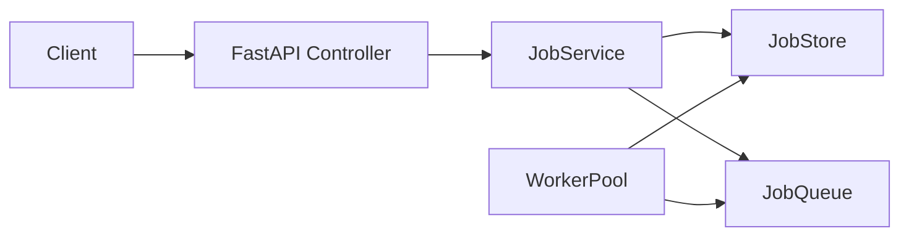

# Simple FastAPI Job Queue

## 1. Problem statement
This project demonstrates a simple background job processing system using FastAPI. The goal is to accept a job request, return immediately with a job identifier, and process the work asynchronously in the background.

The design stays intentionally lightweight for an interview: no Celery, Redis, Kafka, databases, OAuth, Kubernetes, or complex microservices.

## 2. Architecture overview
The app is split into four simple pieces:
- FastAPI controller: handles HTTP requests
- JobService: owns the business flow
- JobStore: keeps jobs in memory safely
- WorkerPool: processes jobs from a queue using worker threads

## 3. Architecture flow diagram


## 4. API endpoints
- POST /jobs
  - Accepts a JSON body with a payload object
  - Returns 202 Accepted with a job_id and status
- GET /jobs/{job_id}
  - Returns the current status, result, error, and attempts
- GET /jobs
  - Lists all known jobs
- GET /health
  - Returns {"status": "ok"}

## 5. Example curl commands
```bash
curl -X POST http://127.0.0.1:3000/jobs \
  -H "Content-Type: application/json" \
  -d '{"payload":{"task":"demo"}}'

curl http://127.0.0.1:3000/jobs/<job_id>

curl http://127.0.0.1:3000/jobs

curl http://127.0.0.1:3000/health
```

## 6. How to run locally
```bash
python3 -m venv .venv
source .venv/bin/activate
pip install -r requirements.txt
uvicorn app.main:app --reload --port 3000
```

Then open:
- http://127.0.0.1:3000/health

## 7. How to run tests
```bash
pytest -q
```

## 8. Concurrency control explanation
The app uses a simple in-memory store with a threading.Lock. This protects shared job state when:
- the FastAPI layer reads or writes job information
- background worker threads update the same job objects

This is enough for a small interview demo and keeps the implementation easy to explain.

## 9. Retry logic explanation
The worker uses a basic retry pattern:
- max retries = 2
- a simulated transient error causes a retry
- if retries are exhausted, the job is marked as failed

This makes the behavior realistic without adding extra infrastructure.

## 10. Known limitations
- Jobs are stored only in memory
- Restarting the app clears all jobs
- No persistence, authentication, or distributed queue
- Workers are process-local threads, not a production-grade scheduler

## 11. Future improvements
- Add persistence with a database
- Add real retry policies and backoff
- Add job timeout handling
- Add a simple admin endpoint to clear jobs
- Add Docker Compose for easier local runs

## Interview talking points
If you need a short explanation in an interview, say:
- The API accepts jobs and returns immediately.
- A worker thread pool processes jobs from an in-memory queue.
- A lock protects shared state.
- The design is simple, easy to reason about, and suitable for a demo.

